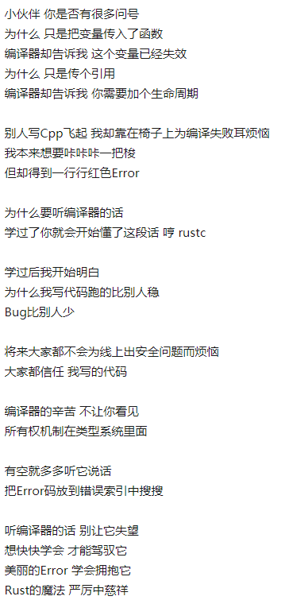
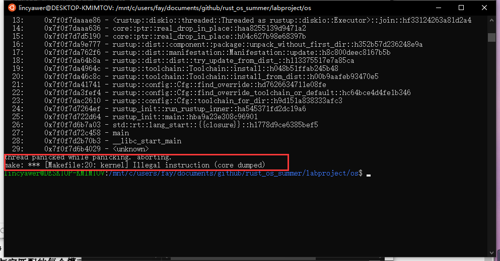

# Rust_os_summer
鹏城实验室和清华大学合办的项目


## 2020年6月26日08:58:36

昨天在这里写了一些准备的话, 但是今天早上为了新建项目, 一不小心把readme也删了, 然后没了...

crates要换成国内的镜像源, 不然下载太慢了。

### 2020年6月26日11:33:45

struct3中的创建结构体失败的那个test不知道要做啥。

上午做到了这里


## 2020年6月28日08:16:49

昨天在完成学校的实验报告, 导致没怎么看.

今天准备把语法全部过一遍, 然后题目能做多少做多少, 明天全部结束. 再做编程题.


### 2020年6月28日09:06:17

- `Fn`：表示捕获方式为通过引用（`&T`）的闭包
- `FnMut`：表示捕获方式为通过可变引用（`&mut T`）的闭包
- `FnOnce`：表示捕获方式为通过值（`T`）的闭包


### 2020年6月28日11:57:54

看到了泛型, 泛型tcl  我C++的泛型都没搞懂


### 2020年6月28日16:20:53

定义宏中的指示符类型:

这里列出全部指示符：

- `block`
- `expr` 用于表达式
- `ident` 用于变量名或函数名
- `item`
- `pat` (**模式** *pattern*)
- `path`
- `stmt` (**语句** *statement*)
- `tt` (**标记树** *token tree*)
- `ty` (**类型** *type*)

[宏的重复](https://rustwiki.org/zh-CN/rust-by-example/macros/repeat.html)


[enum类型的解构操作](https://rustwiki.org/zh-CN/rust-by-example/custom_types/enum.html)

```rust
// 此函数将一个 `WebEvent` enum 作为参数，无返回值。
fn inspect(event: WebEvent) {
    match event {
        WebEvent::PageLoad => println!("page loaded"),
        WebEvent::PageUnload => println!("page unloaded"),
        // 从 `enum` 里解构出 `c`。
        WebEvent::KeyPress(c) => println!("pressed '{}'.", c),
        WebEvent::Paste(s) => println!("pasted \"{}\".", s),
        // 把 `Click` 解构给 `x` and `y`。
        WebEvent::Click { x, y } => {
            println!("clicked at x={}, y={}.", x, y);
        },
    }
}
```


### 2020年6月28日20:59:01

今天看到错误处理, 题目也写到错误处理。 收工。


## 2020年6月29日11:30:44

题目err1还有点问题, 关于match, err处理这块还是不熟悉

错误处理这里要多看


### 2020年6月29日16:51:36

errorsn这个文件要多看看, 裂开来


## 2020年6月30日10:37:25

给函数传数组的时候, 使用固定大小的数组, `mut arr: [u32,5]`

或者使用胖指针, `arr: &mut [u32]`


### 2020年6月30日16:30:04

刚开始学rust的时候没想那么多，在搜一些rust用法的时候发现网上没有什么关于rust的信息。然后才开始搜rust这门语言，竟然这么年轻。然后在知乎上面看到了很多关于rust的讨论，其中rust编程之道的作者张汉东老师也在里面hhhh，而且发现还是一个这么年轻的作者， 知乎上回答了很多稀奇古怪的问题hhh


回到rust上，感觉rust未来可期，现在缺的只是时间积累，再过几年有了积累之后比其他语言会有很大的优势。




## 2020年7月1日10:57:54

```
cd /mnt/c/users/fay/documents/github/rust_os_summer/labproject/os
```


今天看了看实验的内容, 顺便配置了一下wsl环境, 为以后实验做准备


### 2020年7月1日11:27:32

在`lab0`执行`make run`时出现如下问题, 不知道为啥




### 2020年7月1日22:28:36

目前发现是wsl版本的问题导致的这个安装不完整. 

现在升级了windows系统, 重新安装了wsl, 用了version2, 不知道行不行. 

搞了一天了, 裂开了.

` rustup target add riscv64imac-unknown-none-elf`


## 2020年7月2日10:44:45

配了一整天的环境, 呜呜呜呜呜。 学校的网真垃圾md。 垃圾

用流量下好了那些包


### 2020年7月2日16:41:00

磕磕绊绊总算完成了习题,

其中迭代器\多线程\错误处理\类型转换\标准库的一些知识点还是很不熟悉, 需要进一步加强


### 2020年7月2日21:57:08

今天收工, 用rust实现了`learn python the hard way`中的7个习题

其中,第七个是读取文件, python版本中要求用户输入文件路径后再读取, 但是不知道为什么我输入之后就无法找到该文件, 即打开失败; 如果在代码内固定好要读取的文件就成功了. 

```rust
use std::fs::File;
use std::io::prelude::*;
use std::path::Path;
use std::io::stdin;

fn main() {
    // 创建指向所需的文件的路径
    let mut file = String::new();
    println!("What's your path?");
    stdin().read_line(&mut file).unwrap();

    let path = Path::new(&file);
    let display = path.display();


    // // 创建指向所需的文件的路径
    // let path = Path::new("hello.txt");
    // let display = path.display();

    // 以只读方式打开路径，返回 `io::Result<File>`
    let mut file = match File::open(&path) {
        // `io::Error` 的 `description` 方法返回一个描述错误的字符串。
        Err(why) => panic!("couldn't open {}: {}", display,
                           why.to_string()),
        Ok(file) => file,
    };

    // 读取文件内容到一个字符串，返回 `io::Result<usize>`
    let mut s = String::new();
    match file.read_to_string(&mut s) {
        Err(why) => panic!("couldn't read {}: {}", display,
                           why.to_string()),
        Ok(_) => print!("{} contains:\n{}", display, s),
    }

    // `file` 离开作用域，并且 `hello.txt` 文件将被关闭。
}
```


明天把剩下的几个练习实现一下,  自学rust编程这个阶段就可以告一段落了， 然后到第二个阶段， 自学risc-v系统结构。这个我估计四天左右应该能结束。加油！


## 2020年7月3日11:55:31

发现了是因为readline这个函数读出来的字符串包含了换行符, 目前不知道怎么解决.


### 2020年7月3日14:05:14

`unwrap()` 和`collect()`真是好东西, 要再看看


### 2020年7月3日15:29:07

现在开始看RISC-V架构


计算机体系结构的传统方法是**增量ISA**，新处理器不仅必须实现新的ISA扩展，还必须

实现过去的所有扩展。目的是为了保持向后的二进制兼容性，这样几十年前程序的二进制

版本仍然可以在最新的处理器上正确运行。


机器模式（缩写为 M 模式，M-mode）是 RISC-V 中 *hart*（hardware thread，硬件线

程）可以执行的最高权限模式。在 M 模式下运行的 hart 对内存，I/O 和一些对于启动和配

置系统来说必要的底层功能有着完全的使用权。


机器模式最重要的特性是拦截和处理异常（不寻常的运行时事件）的能力。RISC-V 将

异常分为两类。一类是同步异常，这类异常在指令执行期间产生，如访问了无效的存储器

地址或执行了具有无效操作码的指令时。另一类是中断，它是与指令流异步的外部事件，

比如鼠标的单击。


### 2020年7月3日19:49:31

接下来的一个星期要继续巩固rust, 看一看编程之道里面的章节

学习一下risc-v体系结构, 指令集, 特权指令集规范.


以后在完成实验的时候记得要写学习报告.

现在学一下操作系统的内容,  b站上的王道考研.


进程的五种状态:  运行态, 就绪态(万事俱备,只欠cpu), 阻塞态, 创建态, 终止态


2.1.4


## 2020年7月4日10:48:12

上午看了视频, 感觉还是挺虚的。决定调整一下策略， 直接开始实验， 在实验时有不懂的再去看慕课补知识点比较好。


### 2020年7月4日12:26:34

回顾了一下lab0, 虽然指导书中有一些操作都没有学过。

接下要要做的是定义print和println宏。（现在又可以回去看rust语法了 逃


下午把lab0做完, 然后学习一下怎么在linux环境下用git等东西。砍柴不误磨刀工。


### 2020年7月4日20:01:15

打算明天休息一天, 做一下学校课程里的作业, 以及上一节外教课.

从26号到现在已经9天了。这9天过了一遍rust语法， 现在再看代码大概能知道代码的意思， 但是如果自己写的话， 估计就不是很熟练。 对于一些语法还不是很熟悉。 

然后今天再过了一遍lab0， 感觉自己需要看的还有很多很多。 

自己就感觉要在这几天里看完操作系统和体系结构，就好累。就算是大概的了解一下，但是就搞得自己很焦虑。


## 2020年7月6日08:37:10

休息了一天, 今天准备再回顾一下rust语言, 晚上做一下lab1。


目标：

:ballot_box_with_check:rust编程之道第9,10,13章


## 2020年7月7日09:21:35

昨天效率一点都不高, 学校有一整天的课, 我没听; 但是os感觉自己也没有好好学. :cry:


关于这个问题:


scause和stval传给a1和a2只是为了传递参数, 并没有保存到栈中。

再者，中断处理完成之后也没有必要恢复这个中断产生的原因是什么了。


## 2020年7月7日10:18:30

lab1结束. 现在自己实现一下中断部分。

可以注意一下`timer.rs`中全局变量的声明和使用

```rust
pub static mut TICKS: usize = 0;
```


2020年7月7日11:49:43

自己实现完成, 其中有一些报错还是自己没有熟练掌握模块管理的原因.

现在趁热打铁, 再去看看编程之道.


### 2020年7月7日17:28:03

今天效率还可以, 下午学习了清华学堂在线慕课中一些os的基础知识.

[os笔记](https://www.notion.so/lincyawer/0dd3231f26a9420d89e642339a5abaf4)


## 2020年7月8日11:33:35

## 总结

单纯Rust语言上考虑。
 我们在不同情况下解释`&`的意思：

1. 在表达式上，表示的是借用。
2. 在变量绑定上，表示解地址操作与*类似。
3. 在类型声明上，表示引用类型。
4. 在模式匹配上，**无效关键字**

那么`ref`的通用解释是：

1. 在表达式上，**无效关键字**。
2. 在变量绑定上，表示引用类型。
3. 在类型声明上，**无效关键字**。
4. 在模式匹配上，表示引用类型。

非要给区分`ref`和`&`到底哪个是引用，哪个是借用。我们可以先从词性划分，引用我归类为名词，而借用归类为动词。`&A`在表达式上 表示借用A，这是一个动作，那结果就是产出一个引用类型。所以`let ref B`表示声明了一个引用类型，它只能绑定到某次借用动作上。

**所以`ref` 更适合叫引用， `&`叫借用。**

```rust
#![feature(core_intrinsics)]

fn main() {
    let x = &false;
    print_type_name_of(x);

    let &x = &false;
    print_type_name_of(x);

    let ref x = &false;
    print_type_name_of(x);
}

fn print_type_name_of<T>(_: T) {
    println!("{}", unsafe { std::intrinsics::type_name::<T>() })
}
```

```
&bool
bool
&&bool
```


### 2020年7月8日16:30:54

由于看到助教们还在修改实验内容, 以及考虑到实验的形式汇编, 再加上自己实现的那个代码有好多报错， 打算过几天再看实验内容。

现在再复习一下多线程的内容。


for in 迭代默认是用的into_iter方法, 是移动(move)

还有`iter()`和`iter_mut()`(允许集合被就地修改)


如下为选择 `Box<T>`，`Rc<T>` 或 `RefCell<T>` 的理由：

- `Rc<T>` 允许相同数据有多个所有者；`Box<T>` 和 `RefCell<T>` 有单一所有者。
- `Box<T>` 允许在编译时执行不可变或可变借用检查；`Rc<T>`仅允许在编译时执行不可变借用检查；`RefCell<T>` 允许在运行时执行不可变或可变借用检查。
- 因为 `RefCell<T>` 允许在运行时执行可变借用检查，所以我们可以在即便 `RefCell<T>` 自身是不可变的情况下修改其内部的值。

在不可变值内部改变值就是 **内部可变性** 模式。让我们看看何时内部可变性是有用的，并讨论这是如何成为可能的。


### 明日规划

[refcell](https://kaisery.github.io/trpl-zh-cn/ch15-05-interior-mutability.html)

[引用循环与内存l泄露](https://kaisery.github.io/trpl-zh-cn/ch15-06-reference-cycles.html)

[可拓展的并发](https://kaisery.github.io/trpl-zh-cn/ch16-04-extensible-concurrency-sync-and-send.html)

unsafe Rust

清华的os课

看riscv资料


## 2020年7月9日16:04:18

逆变、协变、不变  晕了  这部分等到时候用到了再看看吧


有个问题: 

```
rust中只要定义了传入或者传出变量是引用的, 就会报错吗
```


2020年7月9日17:20:22

晚上看riscv资料

unsaferust从drop检查开始还没看


2020年7月9日22:51:13

还有缺页异常的最后部分


## 2020年7月10日17:27:05

今天看了虚拟存储部分的内容, 现在可以做实验三了.


开始觉得自己的方法有问题。

选择不听课，但是也没有提高做项目的效率。每天基本上是从九点开始到晚上十点，虽然看起来这里的时间很长，但是实际上真正在做的时间可能只有五六个小时。而且这样还导致我其他课程一点都没有听。反而搞得自己压力很大。

现在看到那些时间，管理大师真的很羡慕他们，他们是怎么做到一天只睡这么短的时间的。

从现在开始改变一下我的策略，每天打算充分利用好六个小时的学习项目的时间。上午两个小时，下午两个小时，晚上两个小时。每天要做什么自己安排。每两个小时结束之后就记录这两个小时自己干了什么，防止做无意义的事情。其他的时间自己可以去完成学校课程内的一些任务以及锻炼身体。

计算一下自己每天可利用的时间的话，我现在打算每天10:00睡觉，第二天6:00起床。7:00开始工作。每一个小时休息15分钟的话在9:30就可以完成上午的两个小时，当然预计还是会有偏差，所以将时间保留为十点。这个时候早饭差不多消化完了，就可以开始运动一下，记记单词，写点算法题。这些从参加这个活动开始就没有再做了，理由是觉得自己没时间，但是实际上，时间挤一挤还是会有的。做完这些之后就可以去吃午饭了。

吃完午饭之后，站立半小时，眺望远方，听点英语听力，然后睡觉。在1:00-1:30左右起床。然后用两个半小时时间去预计完成两个小时的工作量。到4:00之后运动20分钟，然后完成学校课程的作业。5:30去吃午饭，吃完去操场走一走，6:30回到寝室。同样再用两个半小时的时间完成两个小时的工作。

然后在9:00洗澡，洗完澡之后完成一下学校的作业。到10:00睡觉。以上这些都是考虑了较坏的情况。实际过程以这个为基础进行稍微的改动。

虽然不知道这个计划能不能实施成功，大概率是不行的，因为学校的两门课程还有两个实验要完成，但是通过这个计划，我对一整天可以利用的时间有了一个进一步的了解。在这个框架下，我就可以对自己每个时间都要干什么进行调整。比如将上午的两个小时改为做学校的实验。

希望自己能够进入os实习，也能在学校课程中获得好成绩。


## 2020年7月11日09:19:17

第一天第一段结束. 重新做了遍实验二, 并且思考了伙伴算法. 然后去看了源码, 但是跟我想象的不太一样, 下午再接着看看


### 2020年7月11日13:33:04

开始看


2020年7月11日15:10:01

这伙伴系统源码没有注释, 加上自己对这个概念还不是很熟悉, 对rust语法也不是很熟悉, 就导致自己不知道他在干嘛. 

打算在网上找找有注释的, 或者c实现的

https://github.com/godspeed1989/buddy_allocator

https://github.com/matianfu/buddy/blob/master/buddy.c


## 2020年7月13日08:48:22

昨天处理学校的事务, 忙了一天, 没有学习。 并且今天也起不来了。

现在开始学习，还是能保证上午的两个小时的学习时间的。


2020年7月13日17:36:00

今天和同学讨论了一下这个伙伴系统算法源码, 感觉现在自己才有懂进去。

感觉自己今天进步还是蛮大的。


`-- --nocapture`用于显示test中的打印串

`test_heap_add`是选定的待test的函数

```
cargo test test_heap_add -- --nocapture
```


### 2020年7月13日21:23:20


使用了最朴实无华的测试方法: 打印大法

```rust
running 1 test
start: 140198663311816,  end: 140198663312840
end - current_start: 1024
lowbit: 8, prev_power_of_two(end - current_start): 1024

start: 140198663311824,  end: 140198663312840
end - current_start: 1016
lowbit: 16, prev_power_of_two(end - current_start): 512

start: 140198663311840,  end: 140198663312840
end - current_start: 1000
lowbit: 32, prev_power_of_two(end - current_start): 512

start: 140198663311872,  end: 140198663312840
end - current_start: 968
lowbit: 512, prev_power_of_two(end - current_start): 512

start: 140198663312384,  end: 140198663312840
end - current_start: 456
lowbit: 1024, prev_power_of_two(end - current_start): 256

start: 140198663312640,  end: 140198663312840
end - current_start: 200
lowbit: 256, prev_power_of_two(end - current_start): 128

start: 140198663312768,  end: 140198663312840
end - current_start: 72
lowbit: 128, prev_power_of_two(end - current_start): 64

start: 140198663312832,  end: 140198663312840
end - current_start: 8
lowbit: 64, prev_power_of_two(end - current_start): 8

1024

申请
size: 16
class: 4
free_list_len: 32
存在大小为2^4的块

申请
size: 16
class: 4
free_list_len: 32
不存在大小为2^4的块
存在大小为2^5的块
freelist里大小为5的块被成功取出来了, 首地址是140198663311840
freelist[4]里存进去了140198663311856
freelist[4]也里存进去了140198663311840

申请
size: 16
class: 4
free_list_len: 32
存在大小为2^4的块

申请
size: 16
class: 4
free_list_len: 32
不存在大小为2^4的块
不存在大小为2^5的块
存在大小为2^6的块
freelist里大小为6的块被成功取出来了, 首地址是140198663312768
freelist[5]里存进去了140198663312800
freelist[5]也里存进去了140198663312768
freelist里大小为5的块被成功取出来了, 首地址是140198663312768
freelist[4]里存进去了140198663312784
freelist[4]也里存进去了140198663312768

释放
size: 16
class: 4
current_ptr: 140198663311824
buddy: 140198663311808
开始在freelist[4]中找和block邻近的块
block.value() as usize 140198663311824 不是 buddy
开始在freelist[4]中找和block邻近的块
block.value() as usize 140198663312784 不是 buddy

释放
size: 16
class: 4
current_ptr: 140198663311840
buddy: 140198663311856
开始在freelist[4]中找和block邻近的块
block.value() as usize 140198663311840 不是 buddy
开始在freelist[4]中找和block邻近的块
block.value() as usize 140198663311824 不是 buddy
开始在freelist[4]中找和block邻近的块
block.value() as usize 140198663312784 不是 buddy

释放
size: 16
class: 4
current_ptr: 140198663311856
buddy: 140198663311840
开始在freelist[4]中找和block邻近的块
block.value() as usize 140198663311856 不是 buddy
开始在freelist[4]中找和block邻近的块
block.value() as usize 140198663311840 是 buddy
成功合并了current_ptr和buddy, 合并后的地址为140198663311856
current_ptr: 140198663311840
buddy: 140198663311808
开始在freelist[5]中找和block邻近的块
block.value() as usize 140198663311840 不是 buddy
开始在freelist[5]中找和block邻近的块
block.value() as usize 140198663312800 不是 buddy

释放
size: 16
class: 4
current_ptr: 140198663312768
buddy: 140198663312784
开始在freelist[4]中找和block邻近的块
block.value() as usize 140198663312768 不是 buddy
开始在freelist[4]中找和block邻近的块
block.value() as usize 140198663311824 不是 buddy
开始在freelist[4]中找和block邻近的块
block.value() as usize 140198663312784 是 buddy
成功合并了current_ptr和buddy, 合并后的地址为140198663312768
current_ptr: 140198663312768
buddy: 140198663312800
开始在freelist[5]中找和block邻近的块
block.value() as usize 140198663312768 不是 buddy
开始在freelist[5]中找和block邻近的块
block.value() as usize 140198663311840 不是 buddy
开始在freelist[5]中找和block邻近的块
block.value() as usize 140198663312800 是 buddy
成功合并了current_ptr和buddy, 合并后的地址为140198663312768
current_ptr: 140198663312768
buddy: 140198663312832
开始在freelist[6]中找和block邻近的块
block.value() as usize 140198663312768 不是 buddy
test test::test_heap_alloc_and_free ... ok

test result: ok. 1 passed; 0 failed; 0 ignored; 0 measured; 8 filtered out
```


明天正式开始写自己的伙伴系统算法


## 2020年7月14日11:31:07

一个上午, 没有怎么休息, 把伙伴系统写好了。 也不能说是自己写的吧，大部分都是借鉴了陈嘉杰学长的代码， 然后自己修改一下接口， 就移到lab2里了。


现在自己对堆、页表这些概念感到十分的模糊， 没有搞清楚他们之间的关系， 今天后半部分学一下os， 理清他们之间的关系。 然后明天开始做lab3


2020年7月14日21:37:54 

看了os


## 2020年7月15日10:55:59

在实验三中, 相对于实验二的改变有: 

在linker.ld中,  将存放的基地址改为虚拟地址, 并且把数据段都对齐到了4kB, 这样可以保证这一个页的属性是一致的, 否则一个页中如果有两个段的话, 可能一个段是可写的,另一个段不可写, 这样无法标注属性


2020年7月15日15:16:06

再看代码源码的时候, 看到代码里的生命周期和宏定义还是不熟悉, 今天把这两部分再过一遍.


`cargo rustc -- -Z unstable-options --pretty=expanded`可以查看宏展开后的样子(如果文件是cargo生成的二进制包0

`rustc -Z unstable-options --pretty=expanded main.rs`如果是单独的文件


## 2020年7月16日11:54:42

关于address.rs的一些框架理解.


四大基本类型:

`VirtualAddress`

`PhysicalAddress`

`VirtualPageNumber`

`PhysicalPageNumber`


1. mut指针和const指针可以通过`from`变为`VirtualAddress`

2. `VirtualPageNumber`和`PhysicalPageNumber`可以通过`from`互相转换

3. `address.rs`中实现了两个宏, 第一个宏为基本类型添加了`From trait`, 可以从页号变为地址也可以从地址变为页号（物理虚拟都可以）

4. 第二个宏为四个基本类型重载了一些算术运算的操作符

   

   万物之源`VirtualAddress`函数:

   ```rust
   pub fn deref<T>(self) -> &'static mut T
   pub fn page_offset(&self) -> usize
   ```

   `PhysicalAddress`函数:

   ```rust
   pub fn deref_kernel<T>(self) -> &'static mut T //转变为虚拟地址后调用虚拟地址的deref
   pub fn page_offset(&self) -> usize
   ```

   `VirtualPageNumber`函数:

   ```rust
   pub fn deref(self) -> &'static mut [u8; PAGE_SIZE] //转变为虚拟地址之后调用虚拟地址的deref
   pub fn levels(self) -> [usize; 3] //得到一、二、三级页号
   ```

   `PhysicalPageNumber`函数:

   ```rust
   pub fn deref_kernel(self) -> &'static mut [u8; PAGE_SIZE] //转变为物理地址之后调用物理地址的deref_kernel()函数,这个函数里又把物理地址变为虚拟地址,再调用虚拟地址的deref. 套娃石锤
   ```

   

   

   

   

   ### 2020年7月16日15:57:50

   root_table是根页表, 通过vpn3找到第二级页表所在的位置

   

   ```rust
       /// 找到给定虚拟页号的三级页表项
       ///
       /// 如果找不到对应的页表项，则会相应创建页表
       pub fn find_entry(&mut self, vpn: VirtualPageNumber) -> MemoryResult<&mut PageTableEntry> {
           // 从根页表开始向下查询
           // 这里不用 self.page_tables[0] 避免后面产生 borrow-check 冲突（我太菜了）
           let root_table: &mut PageTable = PhysicalAddress::from(self.root_ppn).deref_kernel();
           let mut entry = &mut root_table.entries[vpn.levels()[0]];
           for vpn_slice in &vpn.levels()[1..] {
               if entry.is_empty() {
                   // 如果页表不存在，则需要分配一个新的页表
                   let new_table = PageTableTracker::new(FRAME_ALLOCATOR.lock().alloc()?);
                   let new_ppn = new_table.page_number();
                   // 将新页表的页号写入当前的页表项
                   *entry = PageTableEntry::new(new_ppn, Flags::VALID);
                   // 保存页表
                   self.page_tables.push(new_table);
               }
               // 进入下一级页表（使用偏移量来访问物理地址）
               entry = &mut entry.get_next_table().entries[*vpn_slice];
           }
           // 此时 entry 位于第三级页表
           Ok(entry)
       }
   ```

   

   

   ### 2020年7月16日20:23:05

   机器学习概论的考试取消了, 改成了报告和实验, 开心。 今天晚上做机器学习的实验

   